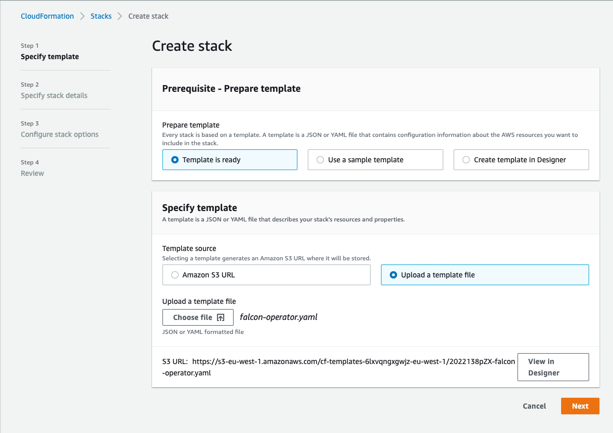
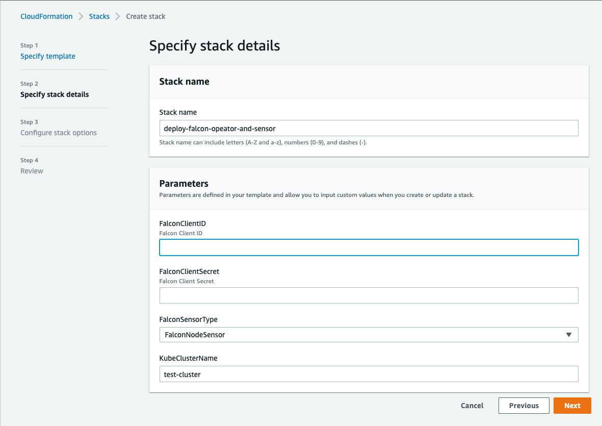

# Deployment using AWS CloudFormation

## Pre-requisites

 - Have CrowdStrike CWP subscription with Falcon Container enabled
 - Create new CrowdStrike API key pair with the following permissions
    * Falcon Images Download: Read
    * Sensor Download: Read
 - Have [AWS EKS QuickStart cluster](https://aws-quickstart.github.io/quickstart-amazon-eks/#_deployment_steps)

## Installation Steps
 - Navigate to AWS Cloud Formation Home: https://console.aws.amazon.com/cloudformation/home
 - *Create stack* -> *With new resources (standard)*
 
 - Upload the [falcon-operator.yaml](./falcon-operator.yaml) file as a custom template
 
   

 - On the next screen provide your:
   - CrowdStrike Falcon API Credentials
   - Sensor type (node sensor or container sensor)
   - and name of your pre-existing EKS quickstart cluster
   
   

 - Continue proceeding to the next page until the installation completes
