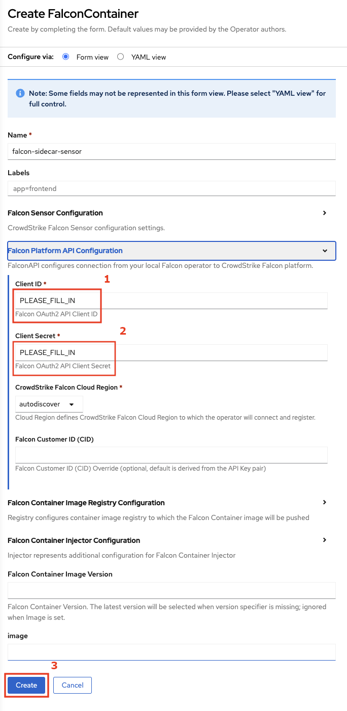

# Deployment Guide for OpenShift (FalconContainer)

> [!NOTE]
> This guide is for rare cases where you need to deploy the FalconContainer sidecar-based sensor. The method does not protect the CoreOS host so is not recommended. Unless you are sure you need this, use the [FalconNodeSensor deployment guide](README.md) instead.

This guide assumes the default configuration for the sensor is sufficient. For all configuration options, see [FalconContainer](resources/container/README.md).

## Prerequisites

Refer to the [FalconNodeSensor deployment guide](README.md):

1. Follow prerequisites listed there
2. Follow the section _Install the operator_

## Deploy the sensor

### Option 1: Via the web console

- To deploy the Falon Sidecar Sensor, click `Create Instance` for the `Falcon Container` Kind under the `Provided APIs` for the Falcon Operator.

   

-  Enter your API client ID and secret under `Falcon Platform API Configuration`, then click `Create`.

   

### Option 2: Via manifest files

- Deploy FalconContainer using the `oc` command, supplying your API client ID and secret in `spec.falcon_api.client_id` and `client_secret`:
  ```
  oc create -f https://raw.githubusercontent.com/CrowdStrike/falcon-operator/main/docs/deployment/openshift/falconcontainer.yaml --edit=true
