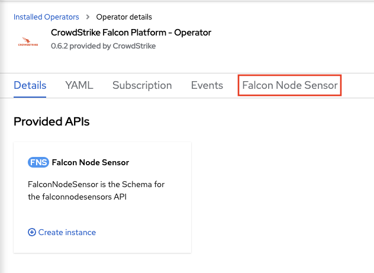

# Deployment Guide for OpenShift
This document will guide you through the installation of falcon-operator and deployment of the:
- [FalconNodeSensor](../../cluster_resources/node/README.md) custom resource to the cluster.

You can choose to install the operator and custom resources through the [web console (GUI)](#installing-the-operator-through-the-web-console-gui) or through the [CLI](#installing-the-operator-through-the-cli).
If you want to automate the deployment of the operator, the CLI method is recommended.

## Prerequisites

- A CrowdStrike Cloud Workload Protection (CWP) subscription
- If your are installing the CrowdStrike Sensor via the Crowdstrike API, you need to create a new CrowdStrike API key pair with the following permissions:
  - Falcon Images Download: Read
  - Sensor Download: Read

## Installing the operator through the Web Console (GUI)

- Authenticate to your OpenShift cluster

   

- Click on the `Operators` dropdown. Then, click on `OperatorHub`

   

- Enter `crowdstrike` into the search bar, and click on the `CrowdStrike Falcon Platform - Operator` tile.

   

- In the side menu, click the `Install` button.

   

- Make any necessary changes as desired to the `InstallPlan` before installing the operator. You can set the update approval to `Automatic` which is the default or `Manual`. If you set to `Manual`, updates require approval before an operator will update.
  Click the `Install` button to begin the install.

   

- Once the operator has completed installation, you can now deploy the custom resources the operator provides.

   

### Deploy the Node Sensor

- To deploy the Falcon Node Sensor, click `Create Instance` for the `Falcon Node Sensor` Kind under the `Provided APIs` for the Falcon Operator.

   

- If using the CrowdStrike API method which connects to the CrowdStrike cloud and will attempt to discover your Falcon Customer ID as well as download the Falcon Sensor container image, make sure that you have a new [CrowdStrike API key pair](#prerequisites) before continuing.

   

   1. Replace with your CrowdStrike API Client ID value
   2. Replace with your CrowdStrike API Client Secret value
   3. Click `Create` to deploy the FalconNodeSensor Kind

- If more configuration is needed for your organization or deployment, `Falcon Sensor Configuration` will provide additional ways to configure the CrowdStrike Falcon Sensor. `DaemonSet Configuration` provides more ways to configure deployment and behavior of the DaemonSet including the ability to deploy the sensor without having to use the CrowdStrike API.

## Installing the operator through the CLI

- Authenticate to your OpenShift cluster
  ```
  oc login --token=sha256~abcde-ABCDE-1 --server=https://openshift.example.com
  ```

- Verify that the Falcon Operator exists in the cluster's OperatorHub
  ```
  oc get packagemanifests -n openshift-marketplace | grep falcon
  ```

- You can view the package manifest by running the following command:
  ```
  oc describe packagemanifests falcon-operator-rhmp -n openshift-marketplace
  ```
  or to get the package manifest in yaml form:
  ```
  oc get packagemanifests -n openshift-marketplace falcon-operator-rhmp -o yaml
  ```

  Important information from the package manifest output such as the `defaultChannel`, `catalogSource`, `catalogSourceNamespace`, and `currentCSV` are used to create a `Subscription` Kind in a yaml file (next steps) to have OpenShift install the operator from the cluster's marketplace.
  You can now install the official [Red Hat Marketplace certified version of the operator](#installing-the-red-hat-marketplace-operator-from-the-console-operatorhub).

### Installing the Red Hat Marketplace Operator from the Console OperatorHub

- Create an operatorgroup `yaml` file:
  ```
  cat << EOF >> og.yaml
  apiVersion: operators.coreos.com/v1
  kind: OperatorGroup
  metadata:
    name: falcon-operator
    namespace: falcon-operator
  spec:
    targetNamespaces:
    - falcon-operator
  ```
  and deploy the operatorgroup
  ```
  oc create -f og.yaml
  ```

- Create a subscription `yaml` file to install the official Red Hat Marketplace certified operator (`redhat-marketplace`). In this example, the certified operator will be installed via the `Subscription` Kind:
  ```
  cat << EOF >> subscription.yaml
  apiVersion: operators.coreos.com/v1alpha1
  kind: Subscription
  metadata:
    name: falcon-operator
  spec:
    channel: alpha
    name: falcon-operator-rhmp
    source: redhat-marketplace
    sourceNamespace: openshift-marketplace
  EOF
  ```
  An [example subscription of the official Red Hat Marketplace certified operator is available](redhat-subscription.yaml) to use and modify as appropriate for your cluster. In this example, the install version is specified via `startingCSV`. Make sure to either delete the `startingCSV` or update the `startingCSV: falcon-operator.v0.5.4` for the version that is listed locally on your cluster.

### Deploy the operator

Deploy the `subscription.yaml` that you create to the cluster for the operator to install.

- Deploy the operator using the `subscription.yaml`
  ```
  oc create -f subscription.yaml -n falcon-operator
  ```

### Deploy the Node Sensor

Once the operator has deployed, you can now deploy the FalconNodeSensor.

- Deploy FalconNodeSensor through the cli using the `oc` command:
  ```
  oc create -n falcon-operator -f https://raw.githubusercontent.com/CrowdStrike/falcon-operator/certified-0.6/config/samples/falcon_v1alpha1_falconnodesensor.yaml --edit=true
  ```

### Deploying the Node Sensor to a custom Namespace

If desired, the FalconNodeSensor can be deployed to a namespace of your choosing instead of deploying to the operator namespace.
To deploy to a custom namespace (replacing `falcon-system` as desired):

- Create a new project
  ```
  oc new-project falcon-system
  ```

- Create the service account in the new namespace
  ```
  oc create sa falcon-operator-node-sensor -n falcon-system
  ```

- Add the service account to the privileged SCC
  ```
  oc adm policy add-scc-to-user privileged system:serviceaccount:falcon-system:falcon-operator-node-sensor
  ```

- Deploy FalconNodeSensor to the custom namespace:
  ```
  oc create -n falcon-system -f https://raw.githubusercontent.com/CrowdStrike/falcon-operator/certified-0.6/config/samples/falcon_v1alpha1_falconnodesensor.yaml --edit=true
  ```

## Uninstalling

When uninstalling the operator, it is important to make sure to uninstall the deployed custom resources first *before* you uninstall the operator.
This will insure proper cleanup of the resources.

### Uninstall using the Web Console (GUI)

- To uninstall in the OpenShift Web Console (GUI), expand the `Operators` menu and click on `Installed Operators`.

   

#### Uninstall the Node Sensor

- Click on the `CrowdStrike Falcon Platform - Operator` listing, followed by clicking on the `Falcon Node Sensor` tab.

   

- On the deployed `FalconNodeSensor` Kind, click the 3 vertical dot action menu on the far right, and click `Delete FalconNodeSensor`.

   

#### Uninstall the Operator

- In the list of `Installed Operators`, click the 3 vertical dot action menu on the far right of the `CrowdStrike Falcon Platform - Operator` listing, and click `Uninstall Operator`.

   

  This will open an uninstall confirmation box, click `Uninstall` to complete the uninstall.

### Uninstall using the CLI

#### Uninstall the Node Sensor

- To uninstall the node sensor, simply remove the FalconNodeSensor resource.
  ```
  oc delete falconnodesensor -A --all
  ```

#### Uninstall the Operator

- To uninstall Falcon Operator, get the name of the subscription that the operator was installed with:
  ```
  oc get sub -n falcon-operator
  ```

- Remove the subscription for the operator:
  ```
  oc delete sub falcon-operator -n falcon-operator
  ```

- Get the name of the ClusterServiceVersion for the operator.
  ```
  oc get csv -n falcon-operator
  ```

- Remove the ClusterServiceVersion for the operator. In this example, version 0.5.4 will be removed:
  ```
  oc delete csv falcon-operator.v0.6.2 -n falcon-operator
  ```

- Delete the OperatorGroup:
  ```
  oc delete operatorgroup falcon-operator -n falcon-operator
  ```
