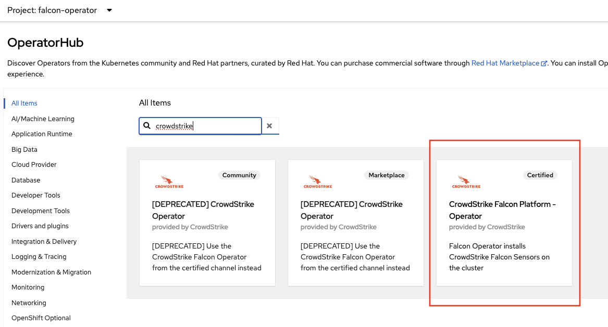
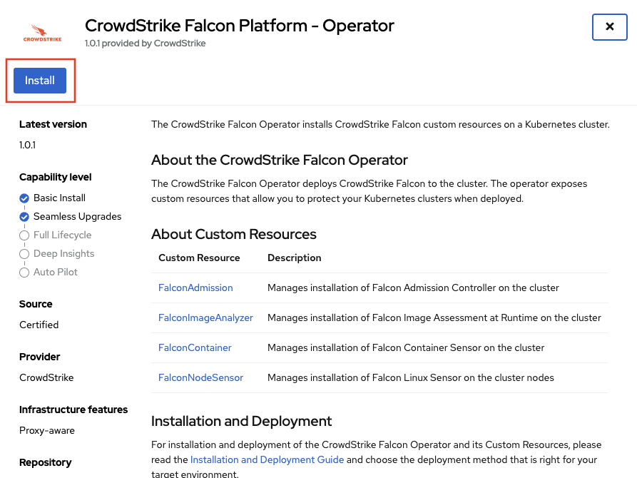
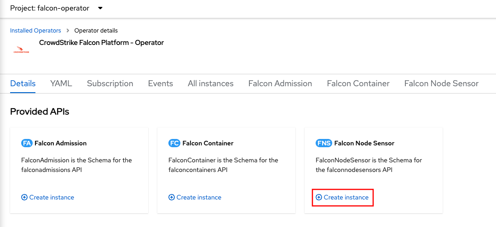
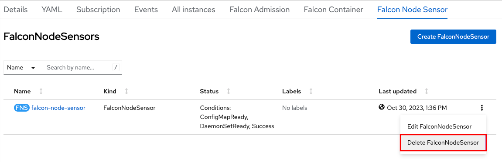
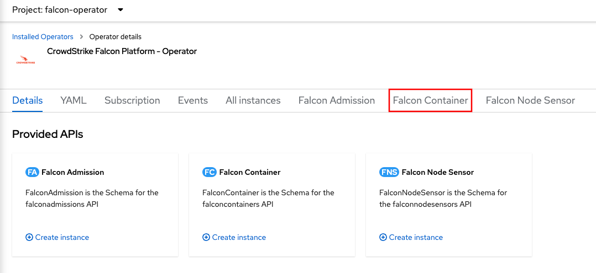

# Deployment Guide for OpenShift

This document guides you through the recommended installation of the CrowdStrike Falcon agent on OpenShift, including self-managed OpenShift and OpenShift cloud services. This approach enables CrowdStrike's breach prevention on Red Hat Enterprise Linux CoreOS (the operating system that powers OpenShift), as well as all container workloads running on top of it. Control plane and worker nodes are both protected by default.

The Falcon agent is deployed as a certified operating in OpenShift's OperatorHub. This guide documents installation in three forms:

- Via the web console -- For quick evaluations.
- Via the command line -- For quick evaluations and script-based configuration management workflows.
- Via manifest files -- For configuration-as-code and GitOps approaches to security. Recommended for production deployments to ensure consistency and reproducibility.

You only need to follow one installation method per section.

The operator provides two custom resources which provide alternative installation options:

- **FalconNodeSensor** (recommended) installs the Falcon Linux sensor as a kernel module on all CoreOS nodes. Protects all hosts and all containers, and has minimal performance impact.
- **FalconContainer** injects the Falcon sensor into every pod as a sidecar container. Does not protect the host and introduces overhead per pod, but can be installed privileged access.

This guide only covers deployment of the FalconNodeSensor, which is the recommended deployment method for OpenShift. In very rare circumstances where you cannot deploy the FalconNodeSensor, refer to the [FalconContainer deployment guide](README-container.md). This guide also covers only the default installation options, which are sufficient for most deployments. For a list of all configuration options, see [FalconNodeSensor](resources/node/README.md) or [FalconContainer](resources/container/README.md).

## Prerequisites

- A Falcon Cloud Security for Containers subscription (previously known as Cloud Workload Protection)
- Red Hat Openshift 4.10+ with `cluster-admin` privileges
  - Self-managed OpenShift on any platform
  - Red Hat OpenShift Service on AWS (ROSA)
  - Azure Red Hat OpenShift (ARO)
  - Red Hat OpenShift on IBM Cloud (RHOIC)

## Create a Falcon API client

To discover your customer ID and download the sensor image, the operator will connect to the Falcon API. You'll need to provide the API client ID and secret to the operator.

1. Navigate to _API clients and keys_ ([US-1](https://falcon.crowdstrike.com/api-clients-and-keys/clients), [US-2](https://falcon.us-2.crowdstrike.com/api-clients-and-keys/clients)).
1. Click `Create API client`.
1. Provide a name and description and the following permissions:
   - Falcon Images Download: Read
   - Sensor Download: Read
1. Click `Create`.
1. Note the client ID and secret, you'll need it in the following steps.

## Install the Falcon operator

### Option 1: Via the web console

- Log in to your OpenShift cluster

   

- Click on the `Operators` dropdown. Then, click on `OperatorHub`

   

- Enter `crowdstrike` into the search bar, and click on the `CrowdStrike Falcon Platform - Operator` tile.

   

- In the side menu, click the `Install` button.

   

- Make any necessary changes as desired to the `InstallPlan` before installing the operator. You can set the update approval to `Automatic` which is the default or `Manual`. If you set to `Manual`, updates require approval before an operator will update.
  You can also set the desired update channel for OpenShift to check for updates. Please note that installation versions are tied to channels, and versions may not exist in every channel. Click the `Install` button to begin the install.

   

- Once the operator has completed installation, you can now deploy the custom resources the operator provides.

   

### Option 2: Via the CLI

The operator is easily installed using Krew and its operator management plugin:

1. Install Krew. See https://krew.sigs.k8s.io/docs/user-guide/setup/install/
2. Verify install with `oc krew`
3. Update krew `oc krew update`
4. Install the operator krew plugin `oc krew install operator`

Once the Krew plugin is installed:

- Log in to your OpenShift cluster
  ```
  oc login --token=sha256~abcde-ABCDE-1 --server=https://openshift.example.com
  ```

- Create the `falcon-operator` namespace:
  ```
  oc new-project falcon-operator
  ```

- Using the krew plugin, install the certified operator
   ```
   oc operator install falcon-operator-rhmp --create-operator-group -n falcon-operator
   ```

### Option 3: Via manifest files

Installing the operator via manifest files allows you to check these files into Git and use a configuration-as-code or GitOps approach to security management.

- Log in to your OpenShift cluster
  ```
  oc login --token=sha256~abcde-ABCDE-1 --server=https://openshift.example.com
  ```

- Create the `falcon-operator` namespace:
  ```
  oc new-project falcon-operator
  ```

- Verify that the Falcon Operator exists in the cluster's OperatorHub
  ```
  oc get packagemanifests -n openshift-marketplace | grep falcon
  # falcon-operator                                    Community Operators   18h
  # falcon-operator-rhmp                               Red Hat Marketplace   18h
  ```

- Create an `OperatorGroup` to allow the operator to be installed in the `falcon-operator` namespace (you can [review operatorgroup.yaml](operatorgroup.yaml)):
  ```
  oc create -f https://raw.githubusercontent.com/CrowdStrike/falcon-operator/main/docs/deployment/openshift/operatorgroup.yaml
  ```

- Create a `Subscription` to install the operator (you can [review redhat-subscription.yaml](redhat-subscription.yaml)):
  ```
  oc create -f https://raw.githubusercontent.com/CrowdStrike/falcon-operator/main/docs/deployment/openshift/redhat-subscription.yaml
  ```

## Deploy the sensor

### Option 1: Via the web console

- To deploy the Falcon Node Sensor, click `Create instance` for the `Falcon Node Sensor` Kind under the `Provided APIs` for the Falcon Operator.

   

- Enter your API client ID and secret under `Falcon Platform API Configuration`, then click `Create`.

   

### Option 2: Via the CLI

Deploying the Falcon sensors via the CLI and with manifest files are the same process. See the next section, _Option 3: Via manifest files_.

### Option 3: Via manifest files

Once the operator has deployed, you can now deploy the FalconNodeSensor.

- Deploy FalconNodeSensor using the `oc` command, supplying your API client ID and secret in `spec.falcon_api.client_id` and `client_secret`:
  ```
  oc create -n falcon-operator -f https://raw.githubusercontent.com/CrowdStrike/falcon-operator/main/config/samples/falcon_v1alpha1_falconnodesensor.yaml --edit=true
  ```

## Uninstalling

When uninstalling the operator, it is important to make sure to uninstall the deployed custom resources first *before* you uninstall the operator.
This will insure proper cleanup of the resources.

### Uninstall using the Web Console (GUI)

- To uninstall in the OpenShift Web Console (GUI), expand the `Operators` menu and click on `Installed Operators`.

   

#### Uninstall the Node Sensor

- Click on the `CrowdStrike Falcon Platform - Operator` listing, followed by clicking on the `Falcon Node Sensor` tab.

   

- On the deployed `FalconNodeSensor` Kind, click the 3 vertical dot action menu on the far right, and click `Delete FalconNodeSensor`.

   

#### Uninstall the Sidecar Sensor

- Click on the `CrowdStrike Falcon Platform - Operator` listing, followed by clicking on the `Falcon Container` tab.

   

- On the deployed `FalconContainer` Kind, click the 3 vertical dot action menu on the far right, and click `Delete FalconContainer`.

   

#### Uninstall the Operator

- In the list of `Installed Operators`, click the 3 vertical dot action menu on the far right of the `CrowdStrike Falcon Platform - Operator` listing, and click `Uninstall Operator`.

   

  This will open an uninstall confirmation box, click `Uninstall` to complete the uninstall.

### Uninstall using the CLI

#### Uninstall using the Krew plugin (Preferred)

To easily uninstall the operator, install Krew if it is not already installed:

1. Install Krew. See https://krew.sigs.k8s.io/docs/user-guide/setup/install/
2. Verify install with `oc krew`
3. Update krew `oc krew update`
4. Install the operator krew plugin `oc krew install operator`

Once the Krew plugin is installed:

1. Using the krew plugin, uninstall the certified operator if it is already installed with
   ```
   oc operator uninstall falcon-operator-rhmp -n falcon-operator -X
   ```

#### Uninstall using the Subscription/CSV method

##### Uninstall the Node Sensor

- To uninstall the node sensor, simply remove the FalconNodeSensor resource.
  ```
  oc delete falconnodesensor -A --all
  ```

##### Uninstall the Sidecar Sensor

- To uninstall Falcon Container simply remove FalconContainer resource. The operator will uninstall Falcon Container product from the cluster.
  ```
  oc delete falconcontainers.falcon.crowdstrike.com default
  ```

##### Uninstall the Operator

- To uninstall Falcon Operator, get the name of the subscription that the operator was installed with:
  ```
  oc get sub -n falcon-operator
  ```

- Remove the subscription for the operator:
  ```
  oc delete sub falcon-operator -n falcon-operator
  ```

- Get the name of the ClusterServiceVersion for the operator.
  ```
  oc get csv -n falcon-operator
  ```

- Remove the ClusterServiceVersion for the operator. In this example, version 0.8.0 will be removed:
  ```
  oc delete csv falcon-operator.v0.8.0 -n falcon-operator
  ```
