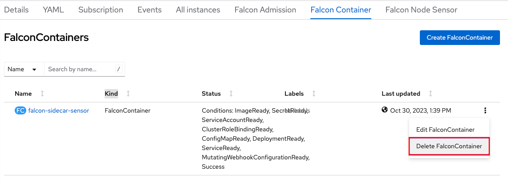

# Uninstalling the Operator

When uninstalling the operator, it is important to make sure to uninstall the deployed custom resources first *before* you uninstall the operator.
This will insure proper cleanup of the resources.

## Option 1: Via the web console

- To uninstall in the OpenShift Web Console (GUI), expand the `Operators` menu and click on `Installed Operators`.

   

### Uninstall the Node Sensor

Follow these steps if you are using the node sensor (the node sensor is the recommended install option):

- Click on the `CrowdStrike Falcon Platform - Operator` listing, followed by clicking on the `Falcon Node Sensor` tab.

   

- On the deployed `FalconNodeSensor` Kind, click the 3 vertical dot action menu on the far right, and click `Delete FalconNodeSensor`.

   

### Uninstall the Sidecar Sensor

Follow these steps if you are using the sidecar sensor (the sidecar sensor is a rarely used alternate install option):

- Click on the `CrowdStrike Falcon Platform - Operator` listing, followed by clicking on the `Falcon Container` tab.

   

- On the deployed `FalconContainer` Kind, click the 3 vertical dot action menu on the far right, and click `Delete FalconContainer`.

   

### Uninstall the Operator

- In the list of `Installed Operators`, click the 3 vertical dot action menu on the far right of the `CrowdStrike Falcon Platform - Operator` listing, and click `Uninstall Operator`.

   

  This will open an uninstall confirmation box, click `Uninstall` to complete the uninstall.

## Option 2: Via the CLI

#### Uninstall using the Krew plugin (Preferred)

The operator is easily uninstalled using Krew and its operator management plugin:

1. Install Krew. See https://krew.sigs.k8s.io/docs/user-guide/setup/install/
2. Verify install with `oc krew`
3. Update krew `oc krew update`
4. Install the operator krew plugin `oc krew install operator`

Once the Krew plugin is installed:

1. Using the krew plugin, uninstall the certified operator:
   ```
   oc operator uninstall falcon-operator-rhmp -n falcon-operator -X
   ```

## Option 3: Via manifest files

### Uninstall the Node Sensor

- To uninstall the node sensor, simply remove the FalconNodeSensor resource.
  ```
  oc delete falconnodesensor -A --all
  ```

### Uninstall the Sidecar Sensor

- To uninstall Falcon Container simply remove FalconContainer resource. The operator will uninstall Falcon Container product from the cluster.
  ```
  oc delete falconcontainers.falcon.crowdstrike.com default
  ```

### Uninstall the Operator

- To uninstall Falcon Operator, get the name of the subscription that the operator was installed with:
  ```
  oc get sub -n falcon-operator
  ```

- Remove the subscription for the operator:
  ```
  oc delete sub falcon-operator -n falcon-operator
  ```

- Get the name of the ClusterServiceVersion for the operator.
  ```
  oc get csv -n falcon-operator
  ```

- Remove the ClusterServiceVersion for the operator. In this example, version 0.8.0 will be removed:
  ```
  oc delete csv falcon-operator.v0.8.0 -n falcon-operator
  ```
