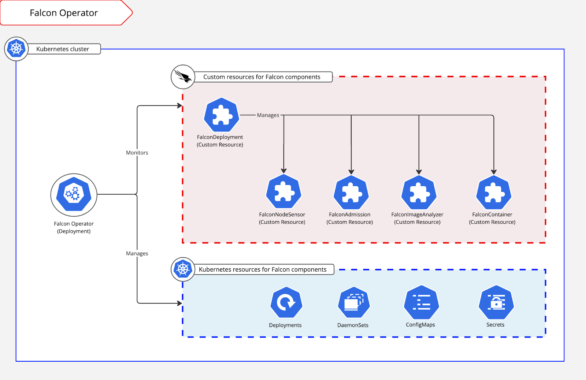

# FalconDeployment CRD

## Overview

The Falcon Operator introduces a Kubernetes custom resource definition (CRD) named FalconDeployment, which is used to deploy and manage other Falcon-specific custom resources. By using the single `FalconDeployment` manifest, you can control the deployment and configuration of multiple components across your Kubernetes environment.

Use `FalconDeployment` to deploy these Falcon components:

| Component | Resource Name | Status |
| :---- | :---- | :---- |
| Falcon Cluster Guard (Node Sensor + Admission Controller) | `FalconClusterGuard` | **Recommended** |
| Falcon Container sensor for Linux | `FalconContainer` | Active |
| Falcon Image Assessment at Runtime agent | `FalconImageAnalyzer` | Active |
| Falcon Sensor for Linux | `FalconNodeSensor` | **Deprecated** — use FalconClusterGuard |
| Falcon Kubernetes Admission Controller | `FalconAdmission` | **Deprecated** — use FalconClusterGuard |

> [!IMPORTANT]
> `FalconNodeSensor` and `FalconAdmission` are deprecated. New deployments should use `deployClusterGuard: true` instead of `deployNodeSensor` and `deployAdmissionController`. Existing FalconDeployment manifests can be migrated using the [migration script](#migrating-from-nodesensoradmission-to-clusterguard).

### Version Support Matrix

The following table shows the minimum supported sensor version for each component per Operator release. For the full per-component matrix, see the individual resource documentation linked below.

| Operator Version | Node Sensor | Container Sensor | KAC (Admission) | IAR (Image Analyzer) | Notes |
|------------------|-------------|------------------|-----------------|----------------------|-------|
| v1.15.0          | >= 7.40     | >= 7.37          | >= 7.33         | >= 1.0.26            | Added IAR log.verbosity. |
| v1.14.0          | >= 7.40     | >= 7.37          | >= 7.33         | >= 1.0.24            | Deprecated node backend option. Added new CrowdStrike config volume.<br/>KAC 7.40+ requires additional resources and increased startup time. |
| v1.13.0          | >= 7.35     | >= 7.37          | >= 7.33         | >= 1.0.24            | Added AI-DR support for container sensor (requires >= 7.37). |
| v1.12.1          | >= 7.35     | >= 7.33          | >= 7.33         | >= 1.0.24            | Added Falcon Data Protection for Cloud support for node sensor.<br/>Added unified image support for IAR. |
| v1.11.0          | >= 7.31     | >= 7.33          | >= 7.33         | >= 1.0.21, <= 1.0.23 | Added IAR image exclusion support. |
| v1.10.0          | >= 7.31     | >= 7.33          | >= 7.33         | >= 1.0.21, <= 1.0.23 | Added unified image path support for container and KAC sensors<br/>KAC added extended resource monitoring capabilities. |
| v1.9.0           | >= 7.31     | <= 7.32          | <= 7.32         | >= 1.0.21, <= 1.0.23 | Added unified image path support for node sensor<br/>KAC added `falconImageAnalyzerNamespace` param.<br/>IAR added Image Analyzer Agent service support. |

### Required permissions

The Falcon Operator retrieves the component images from the CrowdStrike registry. If you need to create a new API key, see [API clients and keys](https://falcon.crowdstrike.com/api-clients-and-keys). To access the registry, you must have a CrowdStrike API client and key with the necessary scopes for the components you want to deploy.

| Component | Required Permission Scopes |
| :---- | :---- |
| Falcon Image Assessment at Runtime agent | Falcon Container CLI: Write Falcon Container Image: Read/Write Falcon Images Download: Read |
| Falcon Sensor for Linux Falcon Container sensor for Linux Falcon Kubernetes Admission Controller | Falcon Images Download: Read Sensor Download: Read |

**Note:** To use the [Advanced autoupdate setting](https://falcon.crowdstrike.com/documentation/page/fd8c8097/falcon-operator---general-deployment#i24900dc), your API key must include this permission scope: Sensor Update Policies: Read

## How the FalconDeployment CRD works

The FalconDeployment acts as a parent resource that manages the deployment and configuration of Falcon component Custom Resources (CRs). It uses a single manifest to simplify and streamline the deployment process across your Kubernetes environment.


This streamlined process allows for easier management, updates, and scaling of your Falcon components within your Kubernetes clusters.

### Configure Falcon components in the single manifest

The FalconDeployment Spec contains fields that are shared by all child components, such as `falcon_api` for configuring Falcon API credentials, as well as fields that enable and optionally configure individual child component settings. For example, when `deployNodeSensor` is `true`, the Falcon Operator deploys the FalconNodeSensor resource using its default settings merged with the settings under falconNodeSensor. The value of falconNodeSensor matches the FalconNodeSensor Spec.

| CRD attributes | Description |
| :---- | :---- |
| falcon\_api.client\_id | Required. CrowdStrike API Client ID |
| falcon\_api.client\_secret | Required. CrowdStrike API Client Secret |
| falcon\_api.cloud\_region | CrowdStrike cloud region (allowed values: autodiscover, us-1, us-2, us-3, eu-1, us-gov-1, us-gov-2); `autodiscover` cannot be used for us-gov-1 or us-gov-2 |
| falcon\_api.cid | (Optional) CrowdStrike Falcon CID API override;<br> Required for us-gov-2 |
| registry.type | (Optional) Type of container registry to be used. Options: acr, ecr, gcr, crowdstrike, openshift |
| registry.acr\_name | (Optional) (Azure only) Name of the Azure Container Registry for Falcon Container push |
| registry.tls.caCertificate | (Optional) CA Certificate bundle as a string or base64 encoded string |
| registry.tls.caCertificateConfigMap | (Optional) Name of ConfigMap containing CA Certificate bundle |
| registry.tls.insecure\_skip\_verify | (Optional) Boolean to allow pushing to docker registries over HTTPS with failed TLS verification |
| deployClusterGuard | (Optional) Boolean to deploy Falcon Cluster Guard (combines node sensor + admission controller). Default: False. **Recommended over deployNodeSensor and deployAdmissionController.** |
| deployImageAnalyzer | (Optional) Boolean to deploy the Image Analyzer. Default: True |
| deployAdmissionController | **(Deprecated)** Boolean to deploy the Admission Controller. Default: False. Use `deployClusterGuard` instead. |
| deployNodeSensor | **(Deprecated)** Boolean to deploy Falcon Node Sensor. Default: False. Use `deployClusterGuard` instead. |
| deployContainerSensor | (Optional) Boolean to deploy Falcon Container. Do not deploy the container sensor alongside the Node Sensor. Default: False |
| falconClusterGuard | (Optional) Additional configurations that map to FalconClusterGuardSpec. See the [FalconClusterGuard reference](https://github.com/CrowdStrike/falcon-operator/tree/main/docs/resources/clusterguard/README.md) for details. |
| falconNodeSensor | **(Deprecated)** Additional configurations that map to FalconNodeSensorSpec. Use `falconClusterGuard` instead. |
| falconImageAnalyzer | (Optional) Additional configurations that map to FalconImageAnalyzerSpec. All values within the custom resource spec can be overridden here. |
| falconContainerSensor | (Optional) Additional configurations that map to FalconContainerSpec. All values within the custom resource spec can be overridden here. |
| falconAdmission | **(Deprecated)** Additional configurations that map to FalconAdmissionBaseConfig. Use `falconClusterGuard` instead. |

The additional configurations for each component are mapped to the Spec for each of the custom resource definitions (CRDs). For specific configuration info, see:

* [Falcon Cluster Guard Custom Resource](https://github.com/CrowdStrike/falcon-operator/tree/main/docs/resources/clusterguard/README.md) **(Recommended)**
* [Falcon Container sensor for Linux Custom Resource](https://github.com/CrowdStrike/falcon-operator/tree/main/docs/resources/container/README.md)
* [Falcon Image Assessment at Runtime Agent Custom Resource](https://github.com/CrowdStrike/falcon-operator/tree/main/docs/resources/imageanalyzer/README.md)
* [Falcon Sensor for Linux Custom Resource](https://github.com/CrowdStrike/falcon-operator/tree/main/docs/resources/node/README.md) (Deprecated)
* [Falcon Kubernetes Admission Controller Custom Resource](https://github.com/CrowdStrike/falcon-operator/tree/main/docs/resources/admission/README.md) (Deprecated)

#### Falcon Secret Settings
| Spec                    | Description                                                                                    |
|:------------------------|:-----------------------------------------------------------------------------------------------|
| falconSecret.enabled    | Enable reading sensitive Falcon API and Falcon sensor values from k8s secret; Default: `false` |
| falconSecret.namespace  | Required if `enabled: true`; k8s namespace with relevant k8s secret                            |
| falconSecret.secretName | Required if `enabled: true`; name of k8s secret with sensitive Falcon API and sensor values    |

Falcon secret settings are used to read the following sensitive Falcon API and sensor values from an existing k8s secret on your cluster.

> [!IMPORTANT]
> When Falcon Secret is enabled, ALL spec parameters in the list of [secret keys](#secret-keys) will be overwritten.
> If a key/value does not exist in your k8s secret, the value will be overwritten as an empty string.

##### Secret Keys
| Secret Key                | Description                                |
|:--------------------------|:-------------------------------------------|
| falcon-client-id          | Replaces `falcon_api.client_id`            |
| falcon-client-secret      | Replaces `falcon_api.client_secret`        |
| falcon-cid                | Replaces `falcon_api.cid` and `falcon.cid` |
| falcon-provisioning-token | Replaces `falcon.provisioning_token`       |

Example of creating k8s secret with sensitive Falcon values:
```bash
kubectl create secret generic falcon-secrets -n $FALCON_SECRET_NAMESPACE \
--from-literal=falcon-client-id=$FALCON_CLIENT_ID \
--from-literal=falcon-client-secret=$FALCON_CLIENT_SECRET \
--from-literal=falcon-cid=$FALCON_CID \
--from-literal=falcon-provisioning-token=$FALCON_PROVISIONING_TOKEN
```

### Example Configurations

Here are some examples of how to use the single manifest to deploy Falcon components:

#### Deploy multiple Falcon components with default configurations

This example shows the recommended configuration for `FalconDeployment`. It deploys `FalconClusterGuard` (which combines node sensor and admission controller into a single resource), `FalconImageAnalyzer`, and does not deploy the FalconContainer.

```
apiVersion: falcon.crowdstrike.com/v1alpha1
kind: FalconDeployment
metadata:
  name: falcon-deployment
spec:
  falcon_api:
    client_id: PLEASE_FILL_IN
    client_secret: PLEASE_FILL_IN
    cloud_region: PLEASE_FILL_IN
  deployClusterGuard: true
```

**Important**: In most scenarios, you deploy either the FalconClusterGuard (which includes the node sensor) or the FalconContainer. However, in some mixed node clusters, for example, when your cluster has both EC2 and Fargate nodes, you can set `deployContainerSensor` to `true`. In this situation, you should deploy the `FalconContainer` to a custom namespace to avoid potential issues with 2 sensor workloads running in the same namespace.

#### Deploy multiple Falcon components with specific image tags

This example demonstrates deploying the `FalconNodeSensor` and `FalconImageAnalyzer` with custom configurations, while not deploying the `FalconAdmissionController` and `FalconContainerSensor`. It highlights how to specify custom images, pull policies, and other configuration options for the enabled components.

```
apiVersion: falcon.crowdstrike.com/v1alpha1
kind: FalconDeployment
metadata:
  name: falcon-deployment
spec:
  falcon_api:
    client_id: PLEASE_FILL_IN
    client_secret: PLEASE_FILL_IN
    cloud_region: PLEASE_FILL_IN
  deployAdmissionController: false
  deployNodeSensor: true
  nodeNamespace: falcon-node
  falconNodeSensor:
    node:
      image: registry.example.com/node-sensor:v1.2
      imagePullPolicy: IfNotPresent
    falcon:
      trace: warn
  deployImageAnalyzer: true
  falconImageAnalyzer:
    image: registry.example.com/image-analyzer:v2.0
    imageAnalyzerConfig:
      imagePullPolicy: Always
  deployContainerSensor: false

```

#### Deploy multiple Falcon components with custom registry configurations

This example demonstrates deploying the `FalconAdmissionController` and `FalconContainerSensor` with custom registry configurations, while not deploying the `FalconNodeSensor` and `FalconImageAnalyzer`. It highlights how to specify different registry types (ACR and ECR) for the overall deployment and individual components.

```
apiVersion: falcon.crowdstrike.com/v1alpha1
kind: FalconDeployment
metadata:
  name: falcon-deployment
spec:
  falcon_api:
    client_id: PLEASE_FILL_IN
    client_secret: PLEASE_FILL_IN
    cloud_region: PLEASE_FILL_IN
  registry:
    type: acr
    acr_name: my-acr
  deployAdmissionController: true
  deployNodeSensor: false
  deployImageAnalyzer: false
  deployContainerSensor: true
  falconContainerSensor:
    registry:
      type: ecr
      ecr_name: my-ecr
```

## Install the Falcon Operator

You install the Falcon Operator by deploying the operator resource to the cluster. These steps differ if your cluster is using Operator Lifecycle Manager (OLM).

Determine if your cluster is using OLM by running:

`kubectl get crd catalogsources.operators.coreos.com`

If your cluster has OLM, you'll see:

`NAME CREATED AT`
clusterserviceversions.operators.coreos.com `YYYY-MM-DDTHH:MM:SSZ`

If your cluster does not have OLM, you'll see:

`Error from server (NotFound): customresourcedefinitions.apiextensions.k8s.io "catalogsources.operators.coreos.com" not found`

If your cluster is not using OLM, install the Operator with `kubectl`:

`kubectl apply -f https://github.com/crowdstrike/falcon-operator/releases/latest/download/falcon-operator.yaml`

If your cluster is using OLM and your cluster is not Red Hat OpenShift, you can install the Operator with either: CrowdStrike Falcon Platform \- Operator on OperatorHub.io or Falcon Operator on ArtifactHUB

When the Falcon Operator is installed, [retrieve your sensor images](https://falcon.crowdstrike.com/documentation/page/eb6c645d/retrieve-the-falcon-sensor-image-for-your-deployment) and then [deploy the Falcon components](#deploy-falcon-components).

**Note**: ArtifactHUB provides an alternative method for OLM-style installations.

## Deploy Falcon components {#deploy-falcon-components}

This command creates and applies the FalconDeployment manifest file for the Falcon Operator, allowing you to edit it before applying, which enables you to deploy and manage CrowdStrike Falcon resources in your Kubernetes cluster.

To install Falcon Operator:

1. Create and open the FalconDeployment manifest file for editing. Make sure to replace `[version_number]` with the correct version tag.
   `kubectl create -f https://raw.githubusercontent.com/crowdstrike/falcon-operator/refs/tags/[version_number]/config/samples/falcon_v1alpha1_falcondeployment.yaml --edit=true`
2. Set the individual resources in the Spec section of the manifest to `true` or `false`. To see basic deployment examples, see [Falcon Operator Spec examples](?tab=t.0#heading=h.d6esf7ainssd).
3. Optional. Provide your custom configuration within the manifest file for each resource.
4. Save the new manifest configuration and exit the editor.
5. The Falcon Operator will automatically detect the changes and initiate the reconciliation process.
6. The Operator will work to bring the actual state of the cluster in line with the desired state specified in your configuration.

**Note:** When deploying the Kubernetes Admission Controller, the Falcon Operator can trigger multiple restarts for the Falcon Admission Controller Pods when deploying alongside other resources. Falcon KAC is designed to ignore namespaces managed by CrowdStrike, so, as new resources are added, such as falconContainer or falconNodeSensor, the KAC pod will redeploy to ignore the new namespaces.

> [!NOTE]
> DaemonSet deployments of sensor versions 7.33 and earlier of the Falcon sensor for Linux are blocked from updates and
> uninstallation if their sensor update policy has the **Uninstall and maintenance protection** setting enabled. Before
> upgrading or uninstalling these versions of the sensor, move the sensors to a new sensor update policy with this
> policy setting turned off. For more info, see [Sensor update and uninstallation for DaemonSet sensor versions 7.33
> and lower](https://falcon.crowdstrike.com/documentation/anchor/sc632f2e).

### Cloud platform-specific deployments

Some cloud platforms have additional configuration requirements. For details, see the appropriate deployment guide:

* AKS
* EKS
* Fargate
* Cloudformation
* GKE
* OpenShift

## Modify Falcon components

To add or remove individual resources without a complete uninstallation:

1. Open the current manifest configuration:
   `kubectl edit falcondeployments`
2. In the opened editor, modify the Spec field for the desired resources to `true` or `false`.
3. Set any other individual resources in the Spec as needed.
4. Provide any custom configuration required.
5. Save the new manifest configuration and exit the editor.

The Falcon Operator will automatically detect these changes and reconcile them, bringing the actual state of the cluster in line with the newly specified desired state.

## Upgrade Falcon components

Each component deployed with the Falcon Operator can be individually upgraded. Follow these steps to upgrade a component:

1. Open the current manifest configuration for editing:
   `kubectl edit falcondeployments`
2. In the opened editor, locate the specific component you want to upgrade.
3. Update the component version using one of these methods:
- If using Falcon API credentials: Add or update the `version` field for the component.
- If using a custom image: Add or update the `image` field for the component.
4. Save the new manifest configuration and exit the editor.

The Falcon Operator will automatically detect these changes and initiate the upgrade process, reconciling the actual state of the cluster with the newly specified desired state.

**Note**: This process works for all components that can be deployed with the Falcon Operator. The operator handles the implementation details of the upgrade based on your changes.

> [!NOTE]
> DaemonSet deployments of sensor versions 7.33 and earlier of the Falcon sensor for Linux are blocked from updates and
> uninstallation if their sensor update policy has the **Uninstall and maintenance protection** setting enabled. Before
> upgrading or uninstalling these versions of the sensor, move the sensors to a new sensor update policy with this
> policy setting turned off. For more info, see [Sensor update and uninstallation for DaemonSet sensor versions 7.33
> and lower](https://falcon.crowdstrike.com/documentation/anchor/sc632f2e).

## Migrating from NodeSensor/Admission to ClusterGuard

If your existing `FalconDeployment` uses `deployNodeSensor` and/or `deployAdmissionController`, you should migrate to `deployClusterGuard`. FalconClusterGuard combines both components into a single resource with a unified configuration.

### Automated migration

A migration script is provided that accepts any mix of Falcon CRD manifests — a FalconDeployment, individual CRs (FalconNodeSensor, FalconAdmission, FalconContainer, FalconImageAnalyzer), or both — and produces a single FalconDeployment with FalconClusterGuard configuration:

```sh
# Migrate an existing FalconDeployment
hack/.venv/bin/python3 hack/migration/migrate_to_clusterguard.py your-fd.yaml -o migrated.yaml

# Assemble individual CRs into a FalconDeployment with FCG migration
hack/.venv/bin/python3 hack/migration/migrate_to_clusterguard.py node-sensor.yaml admission.yaml -o fd.yaml

# Mix: FalconDeployment takes precedence, standalone CRs fill gaps
hack/.venv/bin/python3 hack/migration/migrate_to_clusterguard.py fd.yaml container.yaml -o migrated.yaml

# Override the FCG image and pull policy
hack/.venv/bin/python3 hack/migration/migrate_to_clusterguard.py fd.yaml \
  --fcg-image-override my-registry/falcon-cluster-guard:1.0 \
  --fcg-image-pull-policy Always \
  -o migrated.yaml
```

When a FalconDeployment and standalone CRs are provided together, the FalconDeployment always takes precedence. A standalone CR is only merged in when the FD's corresponding `deploy*` flag is not `true`. For example, if the FalconDeployment has `deployNodeSensor: true`, a standalone FalconNodeSensor file is ignored.

| Flag | Effect |
|:---|:---|
| `--name NAME` | Set `metadata.name` for the output FalconDeployment (default: `falcon`; ignored if a FalconDeployment is in the input) |
| `-o, --output PATH` | Write output to this file (default: `falcon-deployment.yaml`) |
| `--fcg-image-override URI` | Set `falconClusterGuard.image` and `registry.type` to `private` |
| `--fcg-image-pull-policy POLICY` | Set `falconClusterGuard.imagePullPolicy` (`Always`, `IfNotPresent`, `Never`) |

The script requires a Python virtual environment with `ruamel.yaml`. Create one if it does not exist:

```sh
python3 -m venv hack/.venv
hack/.venv/bin/pip install ruamel.yaml
```

### What the migration does

1. Sets `deployClusterGuard: true`
2. Sets `deployNodeSensor: false` and `deployAdmissionController: false`
3. Copies `falconNodeSensor` and `falconAdmission` configuration into the appropriate `falconClusterGuard` fields:
   - `falconNodeSensor.installNamespace`, `falcon_api`, `falcon`, and `falconSecret` are promoted to `falconClusterGuard` top-level fields
   - `falconNodeSensor.node.*` fields (tolerations, resources, backend, etc.) are mapped to `falconClusterGuard.nodeSensor.*`
   - `falconAdmission.admissionConfig.*` fields are mapped to `falconClusterGuard.admissionConfig.*`
   - `falconAdmission.image`, `version`, and `registry` are promoted to `falconClusterGuard` top-level fields

### Fields that require manual attention

The script warns about fields with no direct equivalent:
- `falconNodeSensor.internal` — no equivalent in FalconClusterGuard
- `falconAdmission.resourcequota` — no equivalent in FalconClusterGuard
- `falconAdmission.registry` — see the registry note below

### Image registry changes

FalconClusterGuard does **not** support operator-managed image mirroring. The previous `FalconAdmission` resource supported registry types `acr`, `ecr`, `gcr`, and `openshift`, where the operator would automatically pull the sensor image from CrowdStrike and push it to your cloud registry. FalconClusterGuard only supports two registry modes:

| Registry Type | Description |
|:---|:---|
| `crowdstrike` (default) | Pull images directly from the CrowdStrike registry. The operator creates an image pull secret on your behalf. |
| `private` | Pull images from a private registry you manage. You must set `spec.image` and `spec.imagePullSecrets` yourself. |

The migration script automatically maps `crowdstrike` → `crowdstrike` and `acr`/`ecr`/`gcr`/`openshift` → `private`, with a warning.

If you were relying on operator-managed image mirroring, you will need to mirror the sensor image to your registry yourself before deploying FalconClusterGuard. CrowdStrike provides container image pull scripts for this purpose:

- [falcon-container-sensor-pull](https://github.com/CrowdStrike/falcon-scripts/tree/main/bash/containers/falcon-container-sensor-pull)

### Manual migration

If you prefer to migrate manually:

```yaml
# Before (deprecated)
spec:
  deployNodeSensor: true
  deployAdmissionController: true
  falconNodeSensor:
    installNamespace: falcon-system
    node:
      backend: bpf
      tolerations:
        - key: node-role.kubernetes.io/master
          operator: Exists
          effect: NoSchedule
  falconAdmission:
    admissionConfig:
      failurePolicy: Ignore

# After (recommended)
spec:
  deployClusterGuard: true
  deployNodeSensor: false
  deployAdmissionController: false
  falconClusterGuard:
    installNamespace: falcon-system
    nodeSensor:
      backend: bpf
      tolerations:
        - key: node-role.kubernetes.io/master
          operator: Exists
          effect: NoSchedule
    admissionConfig:
      failurePolicy: Ignore
```

For the full FalconClusterGuard configuration reference, see [FalconClusterGuard Custom Resource](https://github.com/CrowdStrike/falcon-operator/tree/main/docs/resources/clusterguard/README.md).

## Uninstall all Falcon components

To uninstall the Falcon Operator, remove the falcon-operator resource. The operator uninstalls the falcon-operator resource and any CRs deployed from the cluster.

`kubectl delete falcondeployment --all`

> [!NOTE]
> DaemonSet deployments of sensor versions 7.33 and earlier of the Falcon sensor for Linux are blocked from updates and
> uninstallation if their sensor update policy has the **Uninstall and maintenance protection** setting enabled. Before
> upgrading or uninstalling these versions of the sensor, move the sensors to a new sensor update policy with this
> policy setting turned off. For more info, see [Sensor update and uninstallation for DaemonSet sensor versions 7.33
> and lower](https://falcon.crowdstrike.com/documentation/anchor/sc632f2e).
