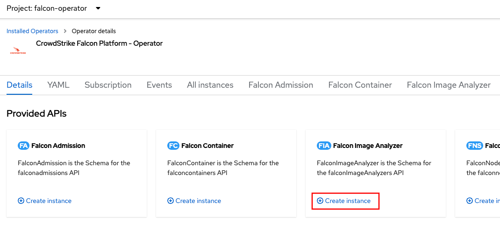
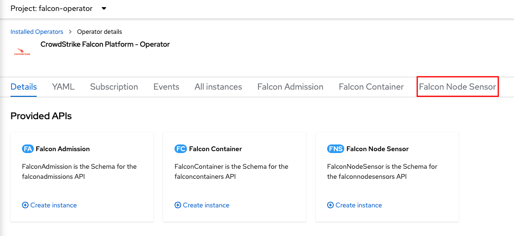
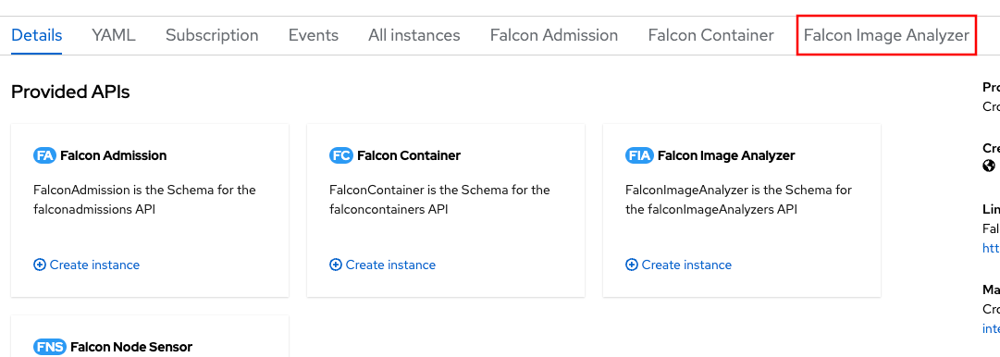
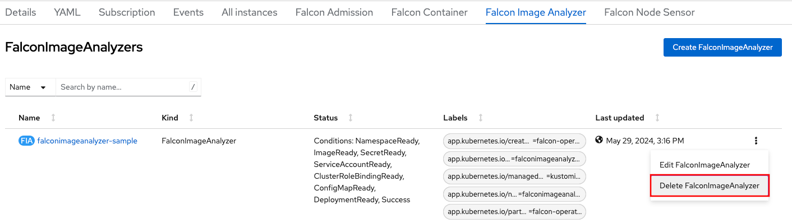
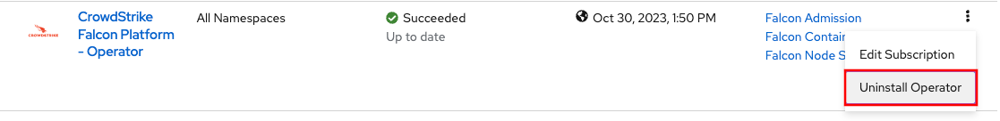
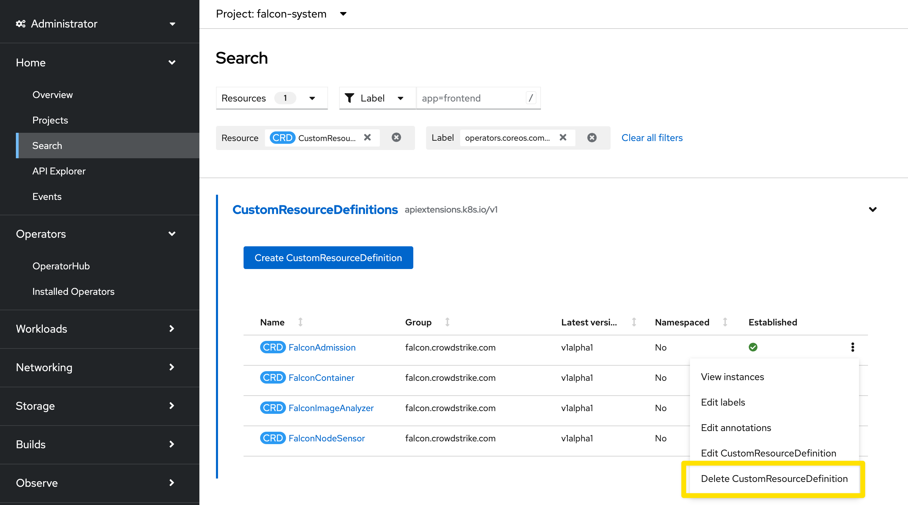
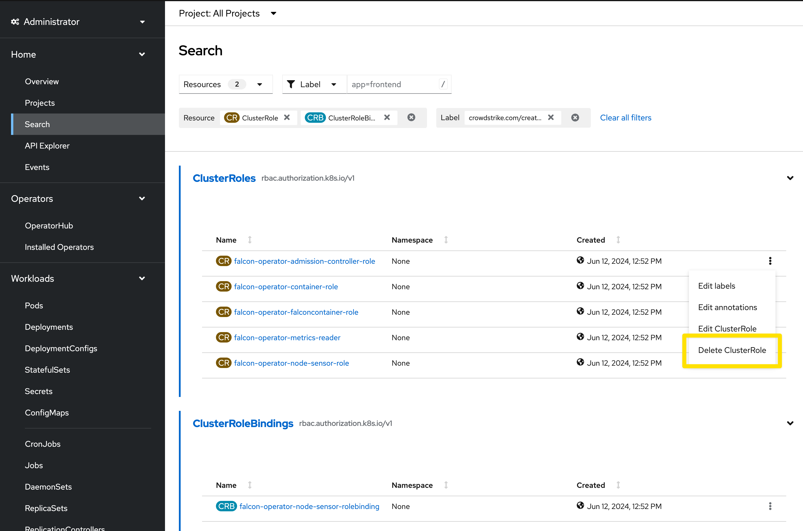

# Deployment Guide for OpenShift

This document will guide you through the installation of the Falcon Operator and deployment of the following custom resources provided by the Falcon Operator:
- [FalconAdmission](../../resources/admission/README.md) with the Falcon Admission Controller image being mirrored from CrowdStrike container registry to OpenShift ImageStreams (on cluster registry).
- [FalconImageAnalyzer](resources/imageanalyzer/README.md) with the Falcon Image Analyzer image being pulled from CrowdStrike container registry.
- [FalconNodeSensor](resources/node/README.md) custom resource to the cluster.

You can choose to install the operator and custom resources through the [web console (GUI)](#installing-the-operator-through-the-web-console-gui) or through the [CLI](#installing-the-operator-through-the-cli).
If you want to automate the deployment of the operator, the CLI method is recommended.

> [!WARNING]
> Previous versions of this guide discussed deployment of the [FalconContainer](resources/container/README.md) resource, but this is no longer recommended for OpenShift. Instead, OpenShift users should only use the FalconNodeSensor for runtime protection. FalconContainer is designed for other Kubernetes environments and is not intended for OpenShift.

## Prerequisites

> [!IMPORTANT]
> - The correct CrowdStrike Cloud (not Endpoint) subscription
> - CrowdStrike API Key Pair (*if installing the CrowdStrike Sensor via the CrowdStrike API*)
>
>    > If you need help creating a new API key pair, review our docs: [CrowdStrike Falcon](https://falcon.crowdstrike.com/support/api-clients-and-keys).
>
>  Make sure to assign the following permissions to the key pair:
>  - Falcon Images Download: **Read**
>  - Sensor Download: **Read**

### Managed OpenShift Considerations
> [!IMPORTANT]
> Managed OpenShift services (e.g. ROSA, ARO, RHOIC, OSD) do not support running user workloads on control plane and infrastructure nodes. However, not deploying the sensor to some nodes in the cluster would create a gap in protection. For this reason, we recommend deploying the sensor to all nodes in the cluster by using the default tolerations. Please be aware that Red Hat site reliability engineering (SRE) may be unable to maintain your cluster's service level agreement (SLA) for availability, and you may have to remove the sensor from control plane and infrastructure nodes during troubleshooting. For more information, see the Red Hat support article [Running custom workloads in OSD/ROSA control plane or infra nodes](https://access.redhat.com/solutions/6972101).
>
> If you would prefer to maintain your SLA and SRE support by limiting your protection to worker nodes, override the tolerations in FalconNodeSensor to be an empty list:
>
> ```yaml
> apiVersion: falcon.crowdstrike.com/v1alpha1
> kind: FalconNodeSensor
> metadata:
> spec:
>   node:
>     tolerations: []
> # ...
> ```

## Installing the operator through the Web Console (GUI)

<details>
  <summary>Click to expand</summary>

- Authenticate to your OpenShift cluster

   

- Click on the `Operators` dropdown. Then, click on `OperatorHub`

   

- Enter `crowdstrike` into the search bar, and click on the `CrowdStrike Falcon Platform - Operator` tile.

   

- In the side menu, click the `Install` button.

   

- Make any necessary changes as desired to the `InstallPlan` before installing the operator. You can set the update approval to `Automatic` which is the default or `Manual`. If you set to `Manual`, updates require approval before an operator will update.
  You can also set the desired update channel for OpenShift to check for updates. Click the `Install` button to begin the install.
   > [!NOTE]
   > Installation versions are tied to channels, and versions may not exist in every channel.

   

- Once the operator has completed installation, you can now deploy the custom resources the operator provides.

   

### Deploy the Node Sensor

<details>
  <summary>Click to expand</summary>

- To deploy the Falcon Node Sensor, click `Create Instance` for the `Falcon Node Sensor` Kind under the `Provided APIs` for the Falcon Operator.

   

- If using the CrowdStrike API method which connects to the CrowdStrike cloud and will attempt to discover your Falcon Customer ID as well as download the Falcon Sensor container image, make sure that you have a new [CrowdStrike API key pair](#prerequisites) before continuing.

   

   1. Replace with your CrowdStrike API Client ID value
   2. Replace with your CrowdStrike API Client Secret value
   3. Click `Create` to deploy the FalconNodeSensor Kind

- If more configuration is needed for your organization or deployment, `Falcon Sensor Configuration` will provide additional ways to configure the CrowdStrike Falcon Sensor. `DaemonSet Configuration` provides more ways to configure deployment and behavior of the DaemonSet including the ability to deploy the sensor without having to use the CrowdStrike API.

</details>

### Deploy the Admission Controller

<details>
  <summary>Click to expand</summary>

- To deploy the Falcon Sidecar Sensor, click `Create Instance` for the `Falcon Admission` Kind under the `Provided APIs` for the Falcon Operator.

   

- If using the CrowdStrike API method which connects to the CrowdStrike cloud and will attempt to discover your Falcon Customer ID as well as download the Falcon Admission container image, make sure that you have a new [CrowdStrike API key pair](#prerequisites) before continuing.

   

   1. Replace with your CrowdStrike API Client ID value
   2. Replace with your CrowdStrike API Client Secret value
   3. Click `Create` to deploy the FalconAdmission Kind

- If more configuration is needed for your organization or deployment, `Falcon Sensor Configuration` will provide additional ways to configure the CrowdStrike Admission Controller. `Falcon Admission Controller Configuration` provides more ways to configure deployment and behavior of the admission controller.

</details>

### Deploy the Image Analyzer

<details>
  <summary>Click to expand</summary>

- To deploy the Falcon Image Analyzer, click `Create Instance` for the `Falcon Image Analyzer` Kind under the `Provided APIs` for the Falcon Operator.

   

- If using the CrowdStrike API method which connects to the CrowdStrike cloud and will attempt to discover your Falcon Customer ID as well as download the Falcon Admission container image, make sure that you have a new [CrowdStrike API key pair](#prerequisites) before continuing.
  On the `Create FalconImageAnalyzer` page, make sure to:

   1. Replace the `Client ID` with your CrowdStrike API Client ID value
   2. Replace the `Client Secret` with your CrowdStrike API Client Secret value
   3. Replace the `CrowdStrike Falcon Cloud Region` with your Falcon cloud region e.g. `us-1`
   4. Click `Create` to deploy the FalconImageAnalyzer Kind

- If more configuration is needed for your organization or deployment, `Falcon Image Analyzer Configuration` provides more ways to configure the deployment and behavior of the image assessment tool.

</details>

</details>

## Installing the operator through the CLI

<details>
  <summary>Click to expand</summary>

### Install using the Krew plugin (Preferred)

<details>
  <summary>Click to expand</summary>

To easily uninstall the operator, install Krew if it is not already installed:

1. Install Krew. See https://krew.sigs.k8s.io/docs/user-guide/setup/install/
2. Verify install with `oc krew`
3. Update krew `oc krew update`
4. Install the operator krew plugin `oc krew install operator`

Once the Krew plugin is installed:

- Authenticate to your OpenShift cluster
  ```
  oc login --token=sha256~abcde-ABCDE-1 --server=https://openshift.example.com
  ```

- If you are not installing the Falcon Operator in the `openshift-operators` namespace, create either the `falcon-operator` namespace or a desired custom namespace:
  ```
  oc new-project falcon-operator
  ```

- Using the krew plugin, install the certified operator
   ```
   oc operator install falcon-operator --create-operator-group -n falcon-operator
   ```

</details>

### Install using the Subscription/CSV method

<details>
  <summary>Click to expand</summary>

- Authenticate to your OpenShift cluster
  ```
  oc login --token=sha256~abcde-ABCDE-1 --server=https://openshift.example.com
  ```

- If you are not installing the Falcon Operator in the `openshift-operators` namespace, create either the `falcon-operator` namespace or a desired custom namespace:
  ```
  oc new-project falcon-operator
  ```

- Verify that the Falcon Operator exists in the cluster's OperatorHub
  ```
  oc get packagemanifests -n openshift-marketplace | grep falcon
  ```

- You can view the package manifest by running the following command:
  ```
  oc describe packagemanifests falcon-operator -n openshift-certified
  ```
  or to get the package manifest in yaml form:
  ```
  oc get packagemanifests -n openshift-marketplace falcon-operator -o yaml
  ```
  Important information from the package manifest output such as the `defaultChannel`, `catalogSource`, `catalogSourceNamespace`, and `currentCSV` are used to create a `Subscription` Kind in a yaml file (next steps) to have OpenShift install the operator from the cluster's marketplace.
  You can now install the official [Red Hat certified version of the operator](#installing-the-red-hat-certified-operator-from-the-console-operatorhub).

#### Installing the Red Hat Certified Operator from the Console OperatorHub
##### Creating an OperatorGroup

- If using a custom namespace or the `falcon-operator` namespace, you will need to create an `OperatorGroup`:
  ```
  cat << EOF >> operatorgroup.yaml
  apiVersion: operators.coreos.com/v1
  kind: OperatorGroup
  metadata:
    name: falcon-operator
    namespace: falcon-operator
  EOF
  ```
  Then, deploy the newly created `OperatorGroup`:
  ```
  oc create -f operatorgroup.yaml -n falcon-operator
  ```
  An [example OperatorGroup for you to modify is available](https://raw.githubusercontent.com/CrowdStrike/falcon-operator/main/docs/deployment/openshift/operatorgroup.yaml)

##### Installing the Red Hat Operator from the Console OperatorHub

- Create a subscription `yaml` file to install the official Red Hat certified operator (`certified-operators`). In this example, the certified operator will be installed via the `Subscription` Kind:
  ```
  cat << EOF >> subscription.yaml
  apiVersion: operators.coreos.com/v1alpha1
  kind: Subscription
  metadata:
    name: falcon-operator
  spec:
    channel: certified-1.0
    name: falcon-operator
    source: certified-operators
    sourceNamespace: openshift-marketplace
  EOF
  ```
  Replace the `channel` in the above spec to the desired deployment channel e.g. `certified-X` (where X is the version), or `stable`, etc. An [example subscription of the official Red Hat certified operator is available](redhat-subscription.yaml) to use and modify as appropriate for your cluster. If a specific operator version is desired, add `startingCSV` with the desired operator version e.g. `startingCSV: falcon-operator.v0.1.2`.

#### Deploy the operator

Deploy the `subscription.yaml` that you create to the cluster for the operator to install.

- Deploy the operator using the `subscription.yaml`
  ```
  oc create -f subscription.yaml -n falcon-operator
  ```

</details>

### Deploy the Node Sensor

<details>
  <summary>Click to expand</summary>

Once the operator has deployed, you can now deploy the FalconNodeSensor.

- Deploy FalconNodeSensor through the cli using the `oc` command:
  ```
  oc create -n falcon-operator -f https://raw.githubusercontent.com/CrowdStrike/falcon-operator/main/config/samples/falcon_v1alpha1_falconnodesensor.yaml --edit=true
  ```

### Deploy the Admission Controller

<details>
  <summary>Click to expand</summary>

- Deploy FalconAdmission through the cli using the `oc` command:
  ```
  oc create -f https://raw.githubusercontent.com/CrowdStrike/falcon-operator/main/docs/deployment/openshift/falconadmission.yaml --edit=true
  ```

</details>

### Deploy the Image Analyzer

<details>
  <summary>Click to expand</summary>

- Deploy FalconImageAnalyzer through the cli using the `oc` command:
  ```
  oc create -f https://raw.githubusercontent.com/CrowdStrike/falcon-operator/main/config/samples/falcon_v1alpha1_falconimageanalyzer.yaml --edit=true
  ```

</details>

</details>

</details>

## Upgrading

<details>
  <summary>Click to expand</summary>

When the operator was installed in OpenShift, the choice was given to use either an `Automatic` approval strategy or a `Manual` approval strategy.
If an `Automatic` approval strategy was chosen, the operator will update itself when OpenShift detects a new version in the update channel.
If a `Manual` approval strategy was chosen, the update must be approved for the operator to update. See [https://docs.openshift.com/container-platform/4.14/operators/admin/olm-upgrading-operators.html#olm-approving-pending-upgrade_olm-upgrading-operators](https://docs.openshift.com/container-platform/4.14/operators/admin/olm-upgrading-operators.html#olm-approving-pending-upgrade_olm-upgrading-operators).

</details>

## Uninstalling

> [!WARNING]
> It is essential to uninstall ALL of the deployed custom resources before uninstalling the Falcon Operator to ensure proper cleanup.

### Uninstall using the Web Console (GUI)

<details>
  <summary>Click to expand</summary>

- To uninstall in the OpenShift Web Console (GUI), expand the `Operators` menu and click on `Installed Operators`.

   

#### Uninstall the Node Sensor

- Click on the `CrowdStrike Falcon Platform - Operator` listing, followed by clicking on the `Falcon Node Sensor` tab.

   

- On the deployed `FalconNodeSensor` Kind, click the 3 vertical dot action menu on the far right, and click `Delete FalconNodeSensor`.

   

#### Uninstall the Sidecar Sensor

The sidecar sensor is not intended for OpenShift. If you installed it by mistake, follow these steps:

- Click on the `CrowdStrike Falcon Platform - Operator` listing, followed by clicking on the `Falcon Container` tab.

   

- On the deployed `FalconContainer` Kind, click the 3 vertical dot action menu on the far right, and click `Delete FalconContainer`.

   

#### Uninstall the Admission Controller

- Click on the `CrowdStrike Falcon Platform - Operator` listing, followed by clicking on the `Falcon Admission` tab.

   

- On the deployed `FalconAdmission` Kind, click the 3 vertical dot action menu on the far right, and click `Delete FalconAdmission`.

   

#### Uninstall the Image Analyzer

- Click on the `CrowdStrike Falcon Platform - Operator` listing, followed by clicking on the `Falcon Image Analyzer` tab.

   

- On the deployed `FalconImageAnalyzer` Kind, click the 3 vertical dot action menu on the far right, and click `Delete FalconImageAnalyzer`.

   

#### Uninstall the Operator

- In the list of `Installed Operators`, click the 3 vertical dot action menu on the far right of the `CrowdStrike Falcon Platform - Operator` listing, and click `Uninstall Operator`.

   

  This will open an uninstall confirmation box, click `Uninstall` to complete the uninstall.

#### Clean up remaining resources

You must remove several resources manually that OpenShift's Operator Lifecycle Manager (OLM) does not
remove automatically when the operator is uninstalled.

- Navigate to the Administrator perspective, Home, Search. Select `CustomResourceDefinition` from the `Resources` dropdown, ensure the filter dropdown is set to `Label`, and enter `operators.coreos.com/falcon-operator.falcon-operator`. Delete the Falcon CRD's displayed.

  

- Navigate to the Administrator perspective, Home, Search. Select `ClusterRole` and `ClusterRoleBinding` from the `Resources` dropdown, ensure the filter dropdown is set to `Label`, and enter `crowdstrike.com/created-by=falcon-operator`. Delete the Falcon CR's and CRB's displayed.

  

- Navigate to the Administrator perspective, Home, Projects. Type `falcon` in the search box. Delete the Falcon project displayed.

  

</details>

### Uninstall using the CLI

<details>
  <summary>Click to expand</summary>

#### Uninstall using the Krew plugin (Preferred)

<details>
  <summary>Click to expand</summary>

To easily uninstall the operator, install Krew if it is not already installed:

1. Install Krew. See https://krew.sigs.k8s.io/docs/user-guide/setup/install/
2. Verify install with `oc krew`
3. Update krew `oc krew update`
4. Install the operator krew plugin `oc krew install operator`

Once the Krew plugin is installed:

1. Using the krew plugin, uninstall the certified operator if it is already installed with
   ```
   oc operator uninstall falcon-operator -n falcon-operator -X
   ```

</details>

#### Uninstall using the Subscription/CSV method

<details>
  <summary>Click to expand</summary>

##### Uninstall the Node Sensor

- To uninstall the node sensor, simply remove the FalconNodeSensor resource.
  ```
  oc delete falconnodesensor falcon-node-sensor
  ```

##### Uninstall the Sidecar Sensor

The sidecar sensor is not intended for OpenShift. If you installed it by mistake, follow these steps:

- To uninstall Falcon Container simply remove FalconContainer resource. The operator will uninstall Falcon Container product from the cluster.
  ```
  oc delete falconcontainers falcon-sidecar-sensor
  ```

##### Uninstall the Admission Controller

- To uninstall Falcon Container simply remove FalconAdmission resource. The operator will then uninstall the Falcon Admission Controller from the cluster:
  ```
  oc delete falconadmissions falcon-admission
  ```

##### Uninstall the Falcon Image Analyzer

- To uninstall Falcon Container simply remove FalconImageAnalyzer resource. The operator will then uninstall the Falcon Image Analyzer from the cluster:
  ```
  oc delete falconimageanalyzers falcon-iar
  ```

##### Uninstall the Operator

- To uninstall Falcon Operator, get the name of the subscription that the operator was installed with:
  ```
  oc get sub -n falcon-operator
  ```

- Remove the subscription for the operator:
  ```
  oc delete sub falcon-operator -n falcon-operator
  ```

- Get the name of the ClusterServiceVersion for the operator:
  ```
  oc get csv -n falcon-operator
  ```

- Remove the ClusterServiceVersion for the operator. In this example, version 0.8.0 will be removed:
  ```
  oc delete csv falcon-operator.v0.8.0 -n falcon-operator
  ```

- Delete the Custom Resource Definitions (CRDs):
  ```
  oc delete $(oc get crd -l operators.coreos.com/falcon-operator.falcon-operator -o name)
  ```

- Delete ClusterRoles and ClusterRoleBindings created by the operator:
  ```
  oc delete $(oc get clusterrole,clusterrolebinding -l crowdstrike.com/created-by=falcon-operator -o name)
  ```

- Delete the operator namespace:
  ```
  oc delete project falcon-operator
  ```

</details>
</details>
